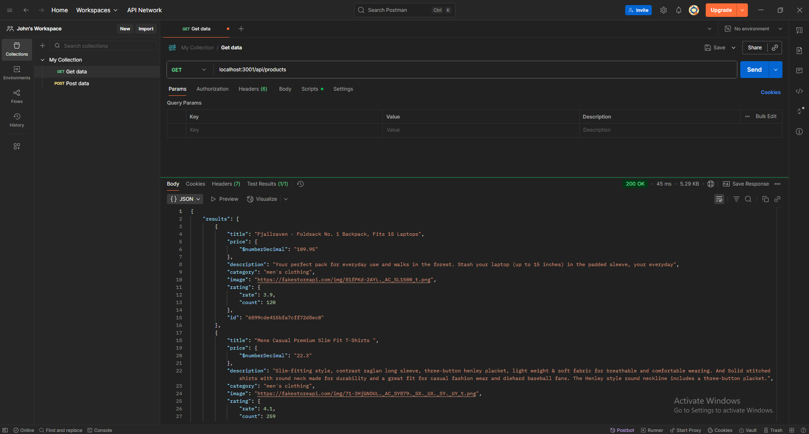

# Instructions

This is Node Express Backend Server for test Products APIs.
Implements `Get All Products`, `Get Products By Category`, `Get Product By Id`, `Create Product`.

# Install dependencies

npm install

# Start the server

npm start

or

npm run dev

# api references

* GET `/products`
  Url localhost:3001/api/products
  Method get

* GET `/products/:id`
  Url localhost:3001/api/products/id=152354
  Method get

* GET `/products?category=Apparel`
  Url localhost:3001/api/products?category=Apparel
  Method get

* POST `/products`
  Url localhost:3001/api/products
  Method post
  Params name, category, price, description

# Screenshot

